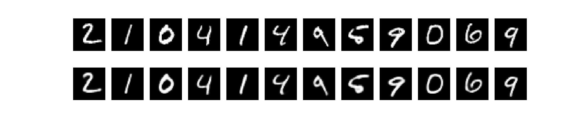
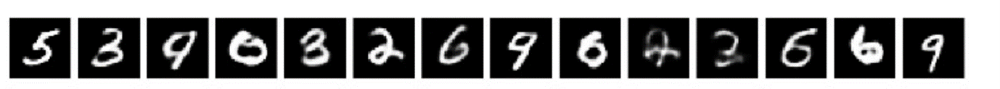
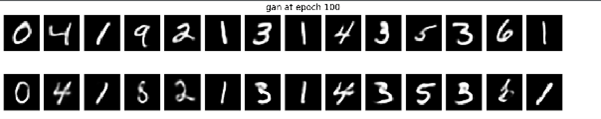

#MNIST_GAN

An GAN and a CGAN implantations for the MNIST dataset, creating an "original" new figures by a NN and adjusted for a non-GPU computer

first of all i have built an AE so the entire GAN could be applied on the latent of the AE, that way instead of using 28X28 images I only have to use a compressed form of 128 vector that represent the image.

The images, and the images after the reconstruction from the latent space.

After that I have implemented a GAN to create a “novel” figures st the generator NN needs to generate good enough images  to “fool” the discriminator NN.

Novel figures by the generator NN

To create figure by demand I implemented an CGAN using a hot-one encoding as a key to specify which figure I want, the discriminator NN get the key  and the generated image and that way “force” the generated NN to  create images by  demand.

The upper row are images from the MNIST dataset, and to second row are images created by the generator NN by demanding the same “label” (figure 0-9) as the upper row.

